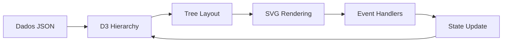

# Documentação Técnica: Gráfico de Árvore Hierárquica Interativo

## 📖 Índice
1. [Visão Geral da Arquitetura](#visão-geral-da-arquitetura)
2. [Estrutura de Dados](#estrutura-de-dados)
3. [Implementação Core com D3.js](#implementação-core-com-d3js)
4. [Sistema de Interatividade](#sistema-de-interatividade)
5. [Gerenciamento de Estado](#gerenciamento-de-estado)
6. [Animações e Transições](#animações-e-transições)
7. [Sistema de Filtros](#sistema-de-filtros)
8. [Otimizações de Performance](#otimizações-de-performance)
9. [Adaptação para React](#adaptação-para-react)
10. [Customizações Avançadas](#customizações-avançadas)

---

## 1. Visão Geral da Arquitetura

### Stack Tecnológica
- **D3.js v7.8.5**: Motor de visualização e cálculos de layout
- **SVG**: Renderização vetorial dos elementos
- **JavaScript ES6+**: Lógica de aplicação
- **CSS3**: Estilização e animações complementares

### Fluxo de Dados



### Componentes Principais

```javascript
// Estrutura modular do sistema
const TreeVisualization = {
    // 1. Parser de dados
    dataParser: null,
    
    // 2. Engine de layout
    layoutEngine: null,
    
    // 3. Renderer SVG
    svgRenderer: null,
    
    // 4. Gerenciador de estado
    stateManager: null,
    
    // 5. Sistema de eventos
    eventSystem: null,
    
    // 6. Controlador de animações
    animationController: null
};
```

---

## 2. Estrutura de Dados

### Schema do Nó

```typescript
interface TreeNode {
    name: string;           // Identificador único e label
    value: number;          // Valor percentual (0-100)
    category: 'action' | 'risk' | 'strategic' | 'category' | 'root';
    severity: 'high' | 'medium' | 'low';
    children?: TreeNode[];  // Sub-nós opcionais
    _children?: TreeNode[]; // Estado colapsado (interno)
    _filtered?: boolean;    // Estado de filtro (interno)
}
```

### Exemplo de Estrutura Hierárquica

```javascript
const treeData = {
    name: "Severidade",
    value: 15.20,
    category: "root",
    severity: "high",
    children: [
        {
            name: "A1",
            value: 23.33,
            category: "action",
            severity: "high",
            children: [
                // Nível 2
                {
                    name: "A10",
                    value: 25.00,
                    category: "action",
                    severity: "high"
                },
                {
                    name: "A100",
                    value: 15.00,
                    category: "action",
                    severity: "low",
                    children: [
                        // Nível 3 - múltiplos filhos
                        { name: "A101", value: 15.00, category: "action", severity: "low" },
                        { name: "A102", value: 15.00, category: "action", severity: "low" },
                        { name: "A103", value: 15.00, category: "action", severity: "low" }
                    ]
                }
            ]
        }
    ]
};
```

### Transformação para D3 Hierarchy

```javascript
// Converter dados planos em hierarquia D3
const root = d3.hierarchy(treeData);

// Adicionar metadados calculados
root.descendants().forEach(d => {
    d.data._depth = d.depth;
    d.data._height = d.height;
    d.data._descendants = d.descendants().length;
});
```

---

## 3. Implementação Core com D3.js

### 3.1 Inicialização do SVG

```javascript
class TreeChart {
    constructor(containerId, config = {}) {
        // Configurações padrão
        this.config = {
            width: 1200,
            height: 600,
            margin: { top: 40, right: 120, bottom: 40, left: 120 },
            nodeWidth: 100,
            nodeHeight: 40,
            horizontalSpacing: 0.6, // Controla distância horizontal
            verticalSpacing: 0.8,   // Controla distância vertical
            ...config
        };
        
        this.initializeSVG(containerId);
        this.initializeScales();
        this.initializeLayout();
    }
    
    initializeSVG(containerId) {
        const { width, height, margin } = this.config;
        
        // Criar SVG responsivo com viewBox
        this.svg = d3.select(containerId)
            .append('svg')
            .attr('viewBox', `0 0 ${width} ${height}`)
            .attr('preserveAspectRatio', 'xMidYMid meet');
        
        // Grupo principal para transformações
        this.mainGroup = this.svg.append('g')
            .attr('transform', `translate(${margin.left},${margin.top})`);
        
        // Grupos separados para links e nós (ordem de renderização)
        this.linksGroup = this.mainGroup.append('g').attr('class', 'links');
        this.nodesGroup = this.mainGroup.append('g').attr('class', 'nodes');
    }
}
```

### 3.2 Configuração do Layout de Árvore

```javascript
initializeLayout() {
    const { width, height, margin, horizontalSpacing, verticalSpacing } = this.config;
    
    // Calcular dimensões efetivas
    const effectiveWidth = (width - margin.left - margin.right) * horizontalSpacing;
    const effectiveHeight = height - margin.top - margin.bottom;
    
    // Criar layout de árvore D3
    this.treeLayout = d3.tree()
        .size([effectiveHeight, effectiveWidth])
        .separation((a, b) => {
            // Customizar separação entre nós
            if (a.parent === b.parent) {
                // Irmãos: menor separação
                return verticalSpacing;
            } else {
                // Primos: maior separação
                return verticalSpacing * 1.5;
            }
        });
}
```

### 3.3 Algoritmo de Renderização

```javascript
render(data) {
    // 1. Criar hierarquia
    this.root = d3.hierarchy(data);
    
    // 2. Aplicar filtros e estado de expansão
    this.applyNodeStates();
    
    // 3. Calcular layout
    const treeData = this.treeLayout(this.root);
    
    // 4. Renderizar links
    this.renderLinks(treeData.links());
    
    // 5. Renderizar nós
    this.renderNodes(treeData.descendants());
    
    // 6. Aplicar zoom/pan
    this.setupZoomBehavior();
}
```

---

## 4. Sistema de Interatividade

### 4.1 Gerenciamento de Cliques

```javascript
class InteractionManager {
    constructor(treeChart) {
        this.chart = treeChart;
        this.selectedNode = null;
        this.expandedNodes = new Set(['root']);
        this.setupEventHandlers();
    }
    
    setupEventHandlers() {
        // Delegação de eventos para performance
        this.chart.nodesGroup.on('click', '.node', (event, d) => {
            event.stopPropagation();
            this.handleNodeClick(d);
        });
        
        // Click fora para desselecionar
        document.addEventListener('click', (e) => {
            if (!e.target.closest('.node')) {
                this.clearSelection();
            }
        });
    }
    
    handleNodeClick(nodeData) {
        // Toggle expansão
        this.toggleNodeExpansion(nodeData);
        
        // Atualizar seleção
        this.selectNode(nodeData);
        
        // Disparar evento customizado
        this.emit('nodeClick', nodeData);
        
        // Re-renderizar
        this.chart.update(nodeData);
    }
    
    toggleNodeExpansion(d) {
        const nodeName = d.data.name;
        
        if (this.expandedNodes.has(nodeName)) {
            // Colapsar
            this.expandedNodes.delete(nodeName);
            this.collapseNode(d);
        } else {
            // Expandir
            this.expandedNodes.add(nodeName);
            this.expandNode(d);
        }
    }
    
    collapseNode(d) {
        if (d.children) {
            d._children = d.children;
            d.children = null;
        }
    }
    
    expandNode(d) {
        if (d._children) {
            d.children = d._children;
            d._children = null;
        }
    }
}
```

### 4.2 Sistema de Detalhes do Nó

```javascript
class NodeDetailsPanel {
    constructor(containerId) {
        this.container = document.getElementById(containerId);
        this.setupTemplate();
    }
    
    setupTemplate() {
        this.template = `
            <div class="node-details-header">
                <h3 id="detail-title">{{name}}</h3>
                <button class="close-btn" onclick="this.hide()">×</button>
            </div>
            <div class="node-details-body">
                <div class="detail-item">
                    <label>ID:</label>
                    <span>{{id}}</span>
                </div>
                <div class="detail-item">
                    <label>Valor:</label>
                    <span>{{value}}%</span>
                </div>
                <div class="detail-item">
                    <label>Categoria:</label>
                    <span class="category-badge category-{{category}}">{{category}}</span>
                </div>
                <div class="detail-item">
                    <label>Severidade:</label>
                    <span class="severity-badge severity-{{severity}}">{{severity}}</span>
                </div>
                <div class="detail-item">
                    <label>Nível:</label>
                    <span>{{depth}}</span>
                </div>
                <div class="detail-item">
                    <label>Filhos:</label>
                    <span>{{childrenCount}}</span>
                </div>
            </div>
        `;
    }
    
    show(nodeData) {
        const html = this.template
            .replace(/{{name}}/g, nodeData.data.name)
            .replace(/{{id}}/g, nodeData.data.name)
            .replace(/{{value}}/g, nodeData.data.value?.toFixed(2) || '0')
            .replace(/{{category}}/g, nodeData.data.category)
            .replace(/{{severity}}/g, nodeData.data.severity)
            .replace(/{{depth}}/g, nodeData.depth)
            .replace(/{{childrenCount}}/g, 
                (nodeData.children?.length || 0) + (nodeData._children?.length || 0));
        
        this.container.innerHTML = html;
        this.container.classList.add('active');
        
        // Animar entrada
        this.animateIn();
    }
    
    animateIn() {
        this.container.animate([
            { transform: 'translateX(400px)', opacity: 0 },
            { transform: 'translateX(0)', opacity: 1 }
        ], {
            duration: 300,
            easing: 'ease-out'
        });
    }
}
```

---

## 5. Gerenciamento de Estado

### 5.1 Store Centralizada

```javascript
class TreeStateManager {
    constructor() {
        this.state = {
            expandedNodes: new Set(['root']),
            selectedNode: null,
            activeFilters: [],
            zoomLevel: 1,
            panPosition: { x: 0, y: 0 },
            hoveredNode: null
        };
        
        this.listeners = new Map();
    }
    
    // Padrão Observer para mudanças de estado
    subscribe(event, callback) {
        if (!this.listeners.has(event)) {
            this.listeners.set(event, []);
        }
        this.listeners.get(event).push(callback);
        
        // Retornar função de unsubscribe
        return () => {
            const callbacks = this.listeners.get(event);
            const index = callbacks.indexOf(callback);
            if (index > -1) {
                callbacks.splice(index, 1);
            }
        };
    }
    
    emit(event, data) {
        if (this.listeners.has(event)) {
            this.listeners.get(event).forEach(callback => callback(data));
        }
    }
    
    // Ações de estado
    toggleNodeExpansion(nodeName) {
        if (this.state.expandedNodes.has(nodeName)) {
            this.state.expandedNodes.delete(nodeName);
        } else {
            this.state.expandedNodes.add(nodeName);
        }
        this.emit('expansionChanged', this.state.expandedNodes);
    }
    
    setSelectedNode(node) {
        this.state.selectedNode = node;
        this.emit('selectionChanged', node);
    }
    
    setFilters(filters) {
        this.state.activeFilters = filters;
        this.emit('filtersChanged', filters);
    }
    
    // Persistência no localStorage
    saveState() {
        const serializable = {
            expandedNodes: Array.from(this.state.expandedNodes),
            activeFilters: this.state.activeFilters,
            zoomLevel: this.state.zoomLevel,
            panPosition: this.state.panPosition
        };
        
        localStorage.setItem('treeState', JSON.stringify(serializable));
    }
    
    loadState() {
        const saved = localStorage.getItem('treeState');
        if (saved) {
            const parsed = JSON.parse(saved);
            this.state.expandedNodes = new Set(parsed.expandedNodes);
            this.state.activeFilters = parsed.activeFilters;
            this.state.zoomLevel = parsed.zoomLevel;
            this.state.panPosition = parsed.panPosition;
        }
    }
}
```

---

## 6. Animações e Transições

### 6.1 Sistema de Animação D3

```javascript
class AnimationController {
    constructor(config = {}) {
        this.config = {
            duration: 500,
            easing: d3.easeCubicInOut,
            stagger: 50,
            ...config
        };
    }
    
    // Animação de entrada dos nós
    animateNodesEnter(nodes) {
        nodes
            .style('opacity', 0)
            .attr('transform', d => {
                const parent = d.parent || d;
                return `translate(${parent.y},${parent.x})`;
            })
            .transition()
            .duration(this.config.duration)
            .delay((d, i) => i * this.config.stagger)
            .ease(this.config.easing)
            .style('opacity', 1)
            .attr('transform', d => `translate(${d.y},${d.x})`);
    }
    
    // Animação de atualização
    animateNodesUpdate(nodes) {
        nodes
            .transition()
            .duration(this.config.duration)
            .ease(this.config.easing)
            .attr('transform', d => `translate(${d.y},${d.x})`)
            .style('opacity', d => d._filtered ? 0.3 : 1);
    }
    
    // Animação de saída
    animateNodesExit(nodes, targetNode) {
        nodes
            .transition()
            .duration(this.config.duration)
            .ease(this.config.easing)
            .attr('transform', d => `translate(${targetNode.y},${targetNode.x})`)
            .style('opacity', 0)
            .remove();
    }
    
    // Animação dos links
    animateLinks(links, diagonal) {
        // Links entrando
        links.enter()
            .append('path')
            .attr('class', 'link')
            .attr('d', d => {
                const o = { x: d.source.x, y: d.source.y };
                return diagonal({ source: o, target: o });
            })
            .transition()
            .duration(this.config.duration)
            .attr('d', diagonal);
        
        // Links atualizando
        links
            .transition()
            .duration(this.config.duration)
            .attr('d', diagonal);
        
        // Links saindo
        links.exit()
            .transition()
            .duration(this.config.duration)
            .attr('d', d => {
                const o = { x: d.source.x, y: d.source.y };
                return diagonal({ source: o, target: o });
            })
            .remove();
    }
}
```

### 6.2 Path Generator para Links Curvos

```javascript
// Gerador de caminhos SVG para links
function createDiagonalPath() {
    return d3.linkHorizontal()
        .x(d => d.y)
        .y(d => d.x);
}

// Alternativa: Links com curva customizada
function createCustomPath(d) {
    const source = d.source;
    const target = d.target;
    
    // Bezier curve customizada
    const midX = (source.y + target.y) / 2;
    
    return `
        M ${source.y} ${source.x}
        C ${midX} ${source.x},
          ${midX} ${target.x},
          ${target.y} ${target.x}
    `;
}

// Links em ângulo reto (step)
function createStepPath(d) {
    const source = d.source;
    const target = d.target;
    const midX = (source.y + target.y) / 2;
    
    return `
        M ${source.y} ${source.x}
        L ${midX} ${source.x}
        L ${midX} ${target.x}
        L ${target.y} ${target.x}
    `;
}
```

---

## 7. Sistema de Filtros

### 7.1 Implementação de Filtros Dinâmicos

```javascript
class FilterSystem {
    constructor(treeChart) {
        this.chart = treeChart;
        this.activeFilters = new Set();
        this.filterCategories = ['action', 'risk', 'strategic', 'category'];
        this.setupFilterUI();
    }
    
    setupFilterUI() {
        const filterContainer = document.createElement('div');
        filterContainer.className = 'filter-container';
        
        this.filterCategories.forEach(category => {
            const button = this.createFilterButton(category);
            filterContainer.appendChild(button);
        });
        
        document.querySelector('.filters').appendChild(filterContainer);
    }
    
    createFilterButton(category) {
        const button = document.createElement('button');
        button.className = 'filter-btn';
        button.dataset.category = category;
        button.innerHTML = `
            <span class="filter-label">${this.getCategoryLabel(category)}</span>
            <span class="filter-count">0</span>
            <span class="filter-close">×</span>
        `;
        
        button.addEventListener('click', () => this.toggleFilter(category));
        return button;
    }
    
    toggleFilter(category) {
        if (this.activeFilters.has(category)) {
            this.activeFilters.delete(category);
        } else {
            this.activeFilters.add(category);
        }
        
        this.applyFilters();
        this.updateFilterUI();
    }
    
    applyFilters() {
        const root = this.chart.root;
        
        // Resetar estado de filtro
        root.descendants().forEach(d => {
            d.data._filtered = false;
        });
        
        if (this.activeFilters.size > 0) {
            // Aplicar filtros
            root.descendants().forEach(d => {
                if (d.data.category !== 'root' && 
                    !this.activeFilters.has(d.data.category)) {
                    d.data._filtered = true;
                    this.hideDescendants(d);
                }
            });
        }
        
        // Re-renderizar
        this.chart.update(root);
    }
    
    hideDescendants(node) {
        if (node.children) {
            node.children.forEach(child => {
                child.data._filtered = true;
                this.hideDescendants(child);
            });
        }
    }
    
    updateFilterUI() {
        // Atualizar contadores
        this.filterCategories.forEach(category => {
            const button = document.querySelector(`[data-category="${category}"]`);
            const count = this.countNodesInCategory(category);
            
            button.querySelector('.filter-count').textContent = count;
            button.classList.toggle('active', this.activeFilters.has(category));
        });
    }
    
    countNodesInCategory(category) {
        return this.chart.root.descendants()
            .filter(d => d.data.category === category && !d.data._filtered)
            .length;
    }
}
```

---

## 8. Otimizações de Performance

### 8.1 Virtualização e Lazy Loading

```javascript
class VirtualizedTree {
    constructor(data, config) {
        this.visibleNodes = new Map();
        this.nodeBuffer = 50; // Nós extras para scroll suave
        this.viewportHeight = config.height;
        this.nodeHeight = 40;
    }
    
    // Calcular nós visíveis baseado no viewport
    calculateVisibleNodes(scrollTop) {
        const startIndex = Math.floor(scrollTop / this.nodeHeight);
        const endIndex = Math.ceil(
            (scrollTop + this.viewportHeight) / this.nodeHeight
        );
        
        // Adicionar buffer
        const bufferedStart = Math.max(0, startIndex - this.nodeBuffer);
        const bufferedEnd = endIndex + this.nodeBuffer;
        
        return { start: bufferedStart, end: bufferedEnd };
    }
    
    // Renderizar apenas nós visíveis
    renderVisibleNodes(nodes, range) {
        const visibleNodes = nodes.slice(range.start, range.end);
        
        // Reutilizar elementos DOM existentes
        const nodeElements = this.nodesGroup
            .selectAll('.node')
            .data(visibleNodes, d => d.data.name);
        
        // Enter
        const enter = nodeElements.enter()
            .append('g')
            .attr('class', 'node');
        
        // Update
        nodeElements.merge(enter)
            .attr('transform', d => `translate(${d.y},${d.x})`);
        
        // Exit
        nodeElements.exit().remove();
    }
}
```

### 8.2 Debouncing e Throttling

```javascript
class PerformanceOptimizer {
    constructor() {
        this.debounceTimers = new Map();
        this.throttleTimestamps = new Map();
    }
    
    // Debounce para operações custosas
    debounce(func, delay, key) {
        return (...args) => {
            clearTimeout(this.debounceTimers.get(key));
            
            const timer = setTimeout(() => {
                func.apply(this, args);
            }, delay);
            
            this.debounceTimers.set(key, timer);
        };
    }
    
    // Throttle para eventos frequentes
    throttle(func, limit, key) {
        return (...args) => {
            const now = Date.now();
            const lastCall = this.throttleTimestamps.get(key) || 0;
            
            if (now - lastCall >= limit) {
                this.throttleTimestamps.set(key, now);
                func.apply(this, args);
            }
        };
    }
    
    // Aplicar otimizações
    optimize(treeChart) {
        // Debounce para resize
        window.addEventListener('resize', 
            this.debounce(() => treeChart.resize(), 300, 'resize')
        );
        
        // Throttle para zoom
        treeChart.svg.on('zoom',
            this.throttle((event) => treeChart.handleZoom(event), 16, 'zoom')
        );
        
        // RequestAnimationFrame para animações suaves
        this.smoothAnimation(treeChart);
    }
    
    smoothAnimation(treeChart) {
        let animationFrame;
        
        const animate = () => {
            // Atualizar apenas se necessário
            if (treeChart.needsUpdate) {
                treeChart.render();
                treeChart.needsUpdate = false;
            }
            
            animationFrame = requestAnimationFrame(animate);
        };
        
        animate();
        
        // Cleanup
        return () => cancelAnimationFrame(animationFrame);
    }
}
```

### 8.3 Memory Management

```javascript
class MemoryManager {
    constructor(maxNodes = 1000) {
        this.maxNodes = maxNodes;
        this.nodeCache = new Map();
        this.disposables = [];
    }
    
    // Cache de cálculos pesados
    memoize(key, computeFn) {
        if (this.nodeCache.has(key)) {
            return this.nodeCache.get(key);
        }
        
        const result = computeFn();
        
        // Limitar tamanho do cache
        if (this.nodeCache.size >= this.maxNodes) {
            const firstKey = this.nodeCache.keys().next().value;
            this.nodeCache.delete(firstKey);
        }
        
        this.nodeCache.set(key, result);
        return result;
    }
    
    // Limpeza de recursos
    cleanup() {
        // Remover event listeners
        this.disposables.forEach(dispose => dispose());
        this.disposables = [];
        
        // Limpar cache
        this.nodeCache.clear();
        
        // Remover elementos DOM órfãos
        d3.selectAll('.node-orphan').remove();
    }
    
    // Detectar memory leaks
    detectLeaks() {
        const usage = performance.memory;
        
        if (usage && usage.usedJSHeapSize > usage.jsHeapSizeLimit * 0.9) {
            console.warn('Memory usage high:', {
                used: `${(usage.usedJSHeapSize / 1048576).toFixed(2)} MB`,
                limit: `${(usage.jsHeapSizeLimit / 1048576).toFixed(2)} MB`
            });
            
            // Forçar garbage collection se disponível
            if (window.gc) {
                window.gc();
            }
        }
    }
}
```

---

## 9. Adaptação para React

### 9.1 Componente React Wrapper

```jsx
import React, { useEffect, useRef, useState, useCallback, useMemo } from 'react';
import * as d3 from 'd3';
import PropTypes from 'prop-types';

const HierarchicalTree = ({ 
    data, 
    width = 1200, 
    height = 600,
    onNodeClick,
    onNodeHover,
    config = {}
}) => {
    const svgRef = useRef(null);
    const chartRef = useRef(null);
    const [selectedNode, setSelectedNode] = useState(null);
    const [expandedNodes, setExpandedNodes] = useState(new Set(['root']));
    const [filters, setFilters] = useState([]);
    
    // Memoizar configuração
    const chartConfig = useMemo(() => ({
        width,
        height,
        margin: { top: 40, right: 120, bottom: 40, left: 120 },
        nodeWidth: 100,
        nodeHeight: 40,
        horizontalSpacing: 0.6,
        animationDuration: 500,
        ...config
    }), [width, height, config]);
    
    // Inicializar chart
    useEffect(() => {
        if (!chartRef.current && svgRef.current) {
            chartRef.current = new TreeChart(svgRef.current, chartConfig);
        }
    }, [chartConfig]);
    
    // Atualizar dados
    useEffect(() => {
        if (chartRef.current && data) {
            chartRef.current.setData(data);
            chartRef.current.render();
        }
    }, [data]);
    
    // Gerenciar estado de expansão
    const handleNodeToggle = useCallback((nodeName) => {
        setExpandedNodes(prev => {
            const newSet = new Set(prev);
            if (newSet.has(nodeName)) {
                newSet.delete(nodeName);
            } else {
                newSet.add(nodeName);
            }
            return newSet;
        });
    }, []);
    
    // Aplicar filtros
    const applyFilter