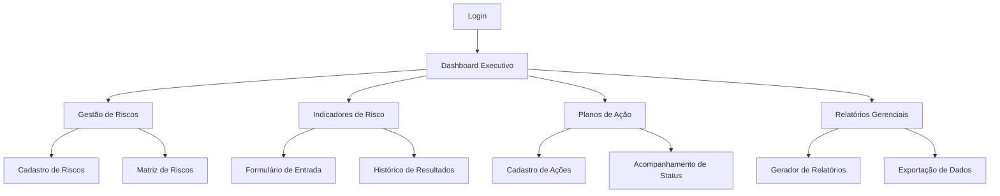
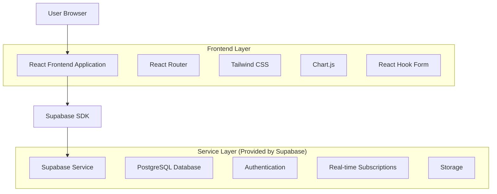

# PRD - Sistema de BI para Assessoria de Risco e Compliance da COGERH

## 1. Product Overview

Sistema de Business Intelligence para gestão de riscos e compliance da COGERH, substituindo a solução atual em Power BI por uma aplicação web moderna desenvolvida em React.js. O sistema permitirá o monitoramento, análise e controle de riscos organizacionais através de dashboards interativos, formulários automatizados e relatórios gerenciais.

O produto visa digitalizar e automatizar os processos de gestão de risco atualmente realizados em planilhas Excel, proporcionando maior eficiência, rastreabilidade e governança na tomada de decisões estratégicas.

## 2. Core Features

### 2.1 User Roles

| Role                     | Registration Method                          | Core Permissions                                                                                       |
| ------------------------ | -------------------------------------------- | ------------------------------------------------------------------------------------------------------ |
| Gestor de Risco          | Autenticação corporativa COGERH              | Visualizar todos os dashboards, criar e editar indicadores de risco, gerar relatórios executivos       |
| Responsável de Processo  | Convite por email + aprovação                | Inserir dados de indicadores dos processos sob sua responsabilidade, visualizar dashboards específicos |
| Auditor Interno          | Cadastro mediante aprovação do administrador | Acesso completo de leitura, exportação de dados para auditoria                                         |
| Administrador do Sistema | Configuração inicial pelo TI                 | Gestão completa de usuários, configurações do sistema, backup e manutenção                             |

### 2.2 Feature Module

Nosso sistema de BI para gestão de riscos consiste nas seguintes páginas principais:

1. **Dashboard Executivo**: visão consolidada de riscos, matriz de riscos por severidade, indicadores-chave de performance (KPIs), gráficos de tendências.
2. **Gestão de Riscos**: cadastro e edição de riscos, classificação por probabilidade e impacto, vinculação com processos organizacionais.
3. **Indicadores de Risco**: formulários para inserção de dados mensais, acompanhamento de metas e tolerâncias, histórico de resultados.
4. **Planos de Ação**: cadastro de ações de mitigação, cronogramas de implementação, acompanhamento de status e evidências.
5. **Processos Organizacionais**: mapeamento de macroprocessos, processos e subprocessos, vinculação com riscos identificados.
6. **Relatórios Gerenciais**: geração de relatórios customizados, exportação para PDF/Excel, agendamento de envios automáticos.
7. **Configurações**: gestão de usuários e permissões, parametrização de categorias de risco, configurações de notificações.

### 2.2.1 Sistema de Notificações (In-App)

O sistema contará com um centro de notificações dentro da aplicação para alertar os usuários sobre eventos importantes. As notificações por e-mail estão fora do escopo inicial, mas podem ser implementadas futuramente.

| Gatilho da Notificação                  | Destinatário(s)              | Canal  | Mensagem (Exemplo)                                            |
| --------------------------------------- | ---------------------------- | ------ | ------------------------------------------------------------- |
| Prazo de ação de mitigação se aproximando | Responsável pela Ação        | No App | "Atenção: A ação 'XYZ' tem o prazo de implementação em 3 dias." |
| Indicador de risco fora da tolerância   | Gestor de Risco, Responsável | No App | "Alerta: O indicador 'ABC' está fora da tolerância definida." |
| Novo risco atribuído                    | Responsável pelo Risco       | No App | "Você foi designado como responsável pelo risco 'R-123'."     |

### 2.3 Page Details

| Page Name                 | Module Name                 | Feature description                                                                                                        |
| ------------------------- | --------------------------- | -------------------------------------------------------------------------------------------------------------------------- |
| Dashboard Executivo       | Visão Geral de Riscos       | Exibir matriz de riscos com classificação por cores (baixo, moderado, alto, muito alto), filtros por período e responsável |
| Dashboard Executivo       | KPIs Principais             | Mostrar indicadores consolidados: total de riscos ativos, percentual dentro da tolerância, ações em atraso                 |
| Dashboard Executivo       | Gráficos de Tendência       | Apresentar evolução temporal dos riscos, comparativo mensal de indicadores, projeções baseadas em histórico                |
| Gestão de Riscos          | Cadastro de Riscos          | Criar novos riscos com campos: evento, probabilidade, impacto, severidade, responsável, classificação                      |
| Gestão de Riscos          | Matriz de Riscos            | Visualizar riscos em matriz probabilidade x impacto, permitir reclassificação através de drag-and-drop                     |
| Gestão de Riscos          | Vinculação com Processos    | Associar riscos aos macroprocessos organizacionais, estabelecer relacionamentos n:n                                        |
| Indicadores de Risco      | Formulário de Entrada       | Inserir dados mensais: resultado, meta, tolerância, justificativas, evidências de implementação                            |
| Indicadores de Risco      | Histórico de Resultados     | Exibir série temporal dos indicadores, comparar com metas estabelecidas, alertas para desvios                              |
| Indicadores de Risco      | Status de Implementação     | Acompanhar situação dos indicadores: não iniciado, em implementação, implementado                                          |
| Planos de Ação            | Cadastro de Ações           | Criar ações de mitigação: descrição, área executora, prazos, responsáveis, tipo de ação                                    |
| Planos de Ação            | Cronograma de Implementação | Visualizar timeline das ações, marcos importantes, dependências entre ações                                                |
| Planos de Ação            | Acompanhamento de Status    | Monitorar progresso das ações: não iniciada, em andamento, concluída, percentual de implementação                          |
| Processos Organizacionais | Hierarquia de Processos     | Navegar pela estrutura: macroprocessos → processos → subprocessos                                                          |
| Processos Organizacionais | Mapeamento de Riscos        | Visualizar riscos associados a cada processo, impacto na geração de valor                                                  |
| Relatórios Gerenciais     | Gerador de Relatórios       | Criar relatórios customizados com filtros por período, responsável, tipo de risco, processo                                |
| Relatórios Gerenciais     | Exportação de Dados         | Exportar relatórios em PDF, Excel, CSV com formatação profissional                                                         |
| Configurações             | Gestão de Usuários          | Cadastrar usuários, definir perfis de acesso, ativar/desativar contas                                                      |
| Configurações             | Parametrização              | Configurar categorias de risco, níveis de tolerância, periodicidade de relatórios                                          |

## 3. Core Process

### Fluxo do Gestor de Risco

O gestor acessa o dashboard executivo para visão geral dos riscos organizacionais, identifica riscos que requerem atenção através da matriz de severidade, navega para a gestão de riscos para criar ou editar registros, vincula riscos aos processos organizacionais relevantes, define planos de ação para mitigação, e gera relatórios gerenciais para apresentação à alta direção.

### Fluxo do Responsável de Processo

O responsável faz login no sistema, acessa a seção de indicadores de risco filtrada pelos processos sob sua responsabilidade, preenche os formulários mensais com dados atualizados dos indicadores, anexa evidências de implementação das ações, revisa o status das ações de sua responsabilidade, e recebe notificações sobre prazos e pendências.

### Fluxo do Auditor Interno

O auditor acessa o sistema com permissões de leitura, consulta o histórico completo de riscos e indicadores, analisa a aderência aos controles estabelecidos, exporta dados para análises externas, e gera relatórios de auditoria com base nos dados coletados.



## 4. User Interface Design

### 4.1 Design Style

#### 4.1.1 Paleta de Cores

* **Tema Principal**: Clean, com fundo branco (#FFFFFF) para máxima legibilidade e profissionalismo
* **Cabeçalho**: Gradiente de tons de azul corporativo, criando identidade visual forte
* **Bordas e Destaques**: Azul claro para elementos interativos e áreas de foco
* **Cores Funcionais**: 
  - Verde (#059669) para indicadores positivos e status de sucesso
  - Vermelho (#DC2626) para alertas, riscos altos e estados de erro
  - Cinza neutro (#6B7280) para textos secundários e elementos de apoio
  - Azul claro (#EFF6FF) para áreas de destaque e hover states

#### 4.1.2 Logo e Identidade Visual

O logo oficial da COGERH deve ser utilizado no cabeçalho da aplicação:
- **URL do Logo**: `https://mfgnuiozkznfqmtnlzgs.supabase.co/storage/v1/object/public/media-files/bf5ff449-a432-4b2c-b33e-ed85c4cbf4a5/1756835962585.png`
- **Posicionamento**: Canto superior esquerdo do cabeçalho
- **Comportamento**: Link para a página inicial (dashboard executivo)

#### 4.1.3 Dimensões e Layout Geral

* **Resolução Alvo**: 1920px de largura por 1020px de altura (padrão desktop corporativo)
* **Estrutura de Layout**:
  - **Cabeçalho (Header)**: Fixo no topo da página, contendo logo, título da aplicação e informações do usuário
  - **Painel de Navegação (Navbar)**: Fixo, localizado imediatamente abaixo do cabeçalho, com menu horizontal
  - **Área de Conteúdo (Main)**: Ocupa o restante do espaço vertical, com scroll independente

#### 4.1.4 Elementos de Interface

* **Estilo de Botões**: Botões arredondados com cantos suaves (border-radius: 8px), efeitos de hover e estados de loading
* **Tipografia**: Inter como fonte principal (16px para textos, 14px para labels), títulos em peso semi-bold, hierarquia clara de tamanhos
* **Layout**: Design baseado em cards com sombras sutis, navegação horizontal fixa, breadcrumbs para orientação, grid responsivo
* **Ícones**: Lucide React para consistência, ícones outline para ações secundárias, filled para ações primárias

### 4.2 Estrutura de Navegação

O sistema implementa uma navegação hierárquica baseada na estrutura organizacional da COGERH, com menus suspensos para organizar as funcionalidades:

#### 4.2.1 Menu Principal

* **Conceitos**: Link direto para visualização dos conceitos fundamentais de gestão de riscos
* **Processos**: Menu suspenso com três subseções:
  - Cadeia de Valor
  - Arquitetura de Processos  
  - Riscos de Processos de Trabalho
* **Riscos Estratégicos**: Menu suspenso organizado em duas categorias:
  - **Portfólio de Riscos**:
    - Matriz de Risco
    - Portfólio de Ações
  - **Monitoramento**:
    - Plano de Ações
    - Indicadores
* **Formulários**: Link para seção de formulários de entrada de dados de indicadores
* **Cadastro**: Link para interfaces de cadastro de entidades (acesso restrito por perfil de usuário)

#### 4.2.2 Comportamento da Navegação

* **Hover States**: Menus suspensos aparecem ao passar o mouse sobre itens principais
* **Indicadores Visuais**: Item ativo destacado com cor diferenciada
* **Breadcrumbs**: Navegação contextual mostrando localização atual na hierarquia
* **Responsividade**: Menu colapsa em hambúrguer em resoluções menores

### 4.3 Princípios de Interatividade

A interface implementa comportamentos avançados de BI para proporcionar experiência similar ao Power BI:

#### 4.3.1 Filtragem Cruzada (Cross-filtering)

* **Filtro Primário**: Cada página possui conjunto de filtros principais (período, área, responsável)
* **Filtro Secundário (Contextual)**:
  1. Clique em segmento de componente visual (barra de gráfico, célula de tabela) ativa filtro secundário
  2. **TODOS** os outros componentes visuais na página são filtrados automaticamente
  3. Remoção do filtro: novo clique no mesmo segmento ou clique em área neutra
  4. Retorno ao estado de filtragem primária após remoção

#### 4.3.2 Feedback Visual

* **Estados de Loading**: Indicadores visuais durante carregamento de dados
* **Hover Effects**: Destaque de elementos interativos
* **Seleção Ativa**: Elementos selecionados com bordas ou backgrounds diferenciados
* **Tooltips Informativos**: Informações contextuais em componentes complexos

### 4.4 Page Design Overview

| Page Name           | Module Name      | UI Elements                                                                                             |
| ------------------- | ---------------- | ------------------------------------------------------------------------------------------------------- |
| Dashboard Executivo | Visão Geral      | Cards com métricas principais, matriz de riscos em heatmap colorido, gráficos Chart.js responsivos      |
| Dashboard Executivo | KPIs             | Indicadores em cards com ícones, progress bars para metas, badges coloridos para status                 |
| Gestão de Riscos    | Formulário       | Campos organizados em seções, dropdowns para seleção, textarea para descrições, validação em tempo real |
| Gestão de Riscos    | Matriz Visual    | Grid interativo 5x5, drag-and-drop habilitado, tooltips informativos, zoom para detalhes                |
| Indicadores         | Entrada de Dados | Formulário step-by-step, upload de arquivos para evidências, calendário para datas, máscaras de input   |
| Planos de Ação      | Timeline         | Linha do tempo horizontal, marcos visuais, cards expansíveis, filtros laterais                          |
| Relatórios          | Gerador          | Interface wizard com 3 etapas, preview em tempo real, templates pré-definidos, configurações avançadas  |

### 4.2.1 Tratamento de Estados Vazios (Empty States)

A interface deve tratar de forma clara e útil os cenários em que não há dados para exibir, guiando o usuário sobre os próximos passos.

| Página/Componente   | Perfil de Usuário        | Mensagem de Estado Vazio                                                                                         |
| ------------------- | ------------------------ | ---------------------------------------------------------------------------------------------------------------- |
| Dashboard Executivo | Gestor de Risco          | "Não há riscos registrados no sistema. Acesse a área de **Gestão de Riscos** para iniciar o processo de cadastro." |
| Dashboard Executivo | Outros Perfis            | "Não há riscos disponíveis para visualização no momento."                                                        |
| Lista de Planos de Ação | Todos | "Nenhum plano de ação cadastrado para este risco." |
| Histórico de Indicadores | Todos | "Não há registros históricos para este indicador." |

### 4.5 Responsiveness

O produto é desktop-first com adaptação completa para tablets e smartphones. A navegação lateral colapsa em menu hambúrguer em telas menores, cards se reorganizam em layout vertical, tabelas se tornam scrolláveis horizontalmente, e formulários ajustam campos para toque otimizado.

## 5. Análise de Conformidade da Modelagem de Dados

### 5.1 Estrutura de Dados - Conformidade Técnica

**✅ Pontos Conformes:**

* Uso consistente de UUIDs como chaves primárias em todas as tabelas

* Campos de auditoria (created\_at, updated\_at) implementados adequadamente

* Relacionamentos bem definidos com foreign keys explícitas

* Normalização adequada evitando redundância de dados

* Enums utilizados para campos com valores controlados

**⚠️ Pontos de Atenção:**

* Alguns campos text poderiam ter restrições de tamanho definidas

* Relacionamento recursivo em `acoes.id_ref` pode gerar complexidade nas consultas

**🔧 Recomendações de Melhoria:**

* Implementar soft delete com campo `deleted_at` para rastreabilidade

* Considerar índices compostos para consultas frequentes

* Validar integridade referencial em relacionamentos n:n

### 5.2 Aderência aos Requisitos de Negócio

**✅ Cobertura Completa:**

* Gestão completa do ciclo de vida dos riscos (identificação, avaliação, tratamento, monitoramento)

* Rastreabilidade entre riscos, processos e ações de mitigação

* Estrutura hierárquica de processos organizacionais

* Categorização de riscos por natureza, categoria e subcategoria

* Acompanhamento temporal de indicadores e resultados

**📊 Métricas e KPIs Suportados:**

* Matriz de riscos por probabilidade x impacto

* Percentual de indicadores dentro da tolerância

* Status de implementação de ações de mitigação

* Evolução temporal dos níveis de risco

* Performance de processos organizacionais

## 6. Arquitetura Técnica

### 6.1 Architecture Design



### 6.2 Technology Description

* **Frontend**: React\@18 + TypeScript\@5 + Tailwind CSS\@3 + Vite\@5

* **Backend**: Supabase (PostgreSQL + Auth + Real-time + Storage)

* **Charts**: Chart.js\@4 + React-Chartjs-2

* **Forms**: React Hook Form\@7 + Zod validation

* **State Management**: Zustand\@4 para estado global

* **UI Components**: Headless UI + Lucide React icons

### 6.3 Route Definitions

| Route            | Purpose                                         |
| ---------------- | ----------------------------------------------- |
| /                | Redirecionamento para dashboard ou login        |
| /login           | Página de autenticação com Supabase Auth        |
| /dashboard       | Dashboard executivo com visão geral dos riscos  |
| /riscos          | Gestão de riscos - listagem, cadastro e edição  |
| /riscos/:id      | Detalhes de um risco específico                 |
| /indicadores     | Formulários de entrada de indicadores de risco  |
| /indicadores/:id | Histórico e detalhes de um indicador            |
| /acoes           | Planos de ação e cronogramas de implementação   |
| /acoes/:id       | Detalhes e acompanhamento de uma ação           |
| /processos       | Hierarquia de processos organizacionais         |
| /processos/:id   | Detalhes de um processo e riscos associados     |
| /relatorios      | Gerador de relatórios customizados              |
| /configuracoes   | Gestão de usuários e parametrizações do sistema |
| /perfil          | Configurações do usuário logado                 |

### 6.4 Data Model

#### 6.4.1 Data Node Definition

Abaixo, cada nó de dados (tabela) está explicitado com seus atributos e tipos, garantindo que não haja referências apenas pelo nome da tabela sem o detalhamento correspondente. Os relacionamentos e chaves (PK/FK) são indicados no diagrama ER.

```mermaid
erDiagram
  020_CONCEITOS {
    uuid id PK
    text conceitos
    text descricao
    date created_at
    date updated_at
  }
  
  006_MATRIZ_RISCOS {
    uuid id PK
    text eventos_riscos
    int probabilidade
    int impacto
    int severidade
    text classificacao
    text priorizado
    bool vulnerabilidade_imagem
    bool afeta_geracao_valor
    uuid responsavel_risco FK
    bool responsabilidade_compartilhada
    uuid demais_responsaveis FK
    date created_at
    date updated_at
    timestamp deleted_at
  }
  
  008_INDICADORES {
    uuid id PK
    uuid id_risco FK
    uuid responsavel_risco FK
    text indicador_risco
    text situacao_indicador
    text justificativa_observacao
    text impacto_n_implementacao
    text meta_desc
    text tolerancia
    text limite_tolerancia
    text tipo_acompanhamento
    number resultado_mes
    text apuracao
    date created_at
    date updated_at
  }
  
  015_RISCOS_X_ACOES_PROC_TRAB {
    uuid id PK
    uuid responsavel_processo FK
    text situacao_risco
    uuid id_risco FK
    text nivel_risco
    text nivel_risco_tratado
    text resposta_risco
    uuid id_acao FK
    uuid id_processo FK
    uuid responsavel_acao FK
    date inicio_planejado
    date fim_planejado
    date inicio_realizado
    date fim_realizado
    text plano_resposta_risco
    text obs
    date created_at
    date updated_at
  }
  
  014_ACOES_CONTROLE_PROC_TRAB {
    uuid id PK
    text acao
    date created_at
    date updated_at
  }
  
  007_RISCOS_TRABALHO {
    uuid id PK
    text risco
    date created_at
    date updated_at
  }
  
  004_MACROPROCESSOS {
    uuid id PK
    enum tipo_macroprocesso
    text macroprocesso
    text link_macro
    bool publicado
    date data_inicio
    date data_termino_prevista
    text situacao
    text planejamento_inicial
    text mapeamento_situacao_atual
    text desenho_situacao_futura
    text monitoramento
    text encerramento
    date created_at
    date updated_at
  }
  
  005_PROCESSOS {
    uuid id PK
    text processo
    uuid id_macro FK
    bool publicado
    text link_processo
    uuid responsavel_processo FK
    text objetivo_processo
    text entregas_processo
    date data_ultima_atualizacao
    date data_inicio
    date data_termino_prevista
    text situacao
    text planejamento_inicial
    text mapeamento_situacao_atual
    text desenho_situacao_futura
    text monitoramento
    text encerramento
  }
  
  013_SUBPROCESSOS {
    uuid id PK
    text cod_subprocesso
    text subprocesso
    uuid id_processo FK
    text link_subprocesso
    text link_manual
    date data_inicio
    date data_termino_prevista
    text situacao
    text planejamento_inicial
    text mapeamento_situacao_atual
    text desenho_situacao_futura
    text monitoramento
    text encerramento
    bool publicado
    date created_at
    date updated_at
  }
  
  010_NATUREZA {
    uuid id PK
    text desc_natureza
    date created_at
    date updated_at
  }
  
  011_CATEGORIA {
    uuid id PK
    text desc_categoria
    uuid id_natureza FK
    date created_at
    date updated_at
  }
  
  012_SUBCATEGORIA {
    uuid id PK
    text desc_subcategoria
    uuid id_categoria FK
    date created_at
    date updated_at
  }
  
  009_ACOES {
    uuid id PK
    uuid id_ref FK
    text desc_acao
    json area_executora
    bool acao_transversal
    text tipo_acao
    date prazo_implementacao
    date novo_prazo
    text status
    text justificativa_observacao
    text impacto_atraso_nao_implementacao
    text desc_evidencia
    text situacao
    text mitiga_fatores_risco
    text url
    number perc_implementacao
    text apuracao
    date created_at
    date updated_at
  }
  
  017_REL_RISCO_PROCESSO {
    uuid id PK
    uuid id_risco FK
    uuid id_macro FK
    date created_at
    date updated_at
  }
  
  018_REL_RISCO {
    uuid id PK
    uuid id_risco FK
    uuid id_natureza FK
    uuid id_categoria FK
    uuid id_subcategoria FK
    date created_at
    date updated_at
  }
  
  016_REL_ACOES_RISCOS {
    uuid id PK
    uuid id_acao FK
    uuid id_risco FK
    date created_at
    date updated_at
  }
  
  003_AREAS_GERENCIAS {
    uuid id PK
    text nome_area
    text sigla_area
    text responsavel_area
    bool ativa
    date created_at
    date updated_at
  }
  
  001_PERFIS {
    uuid id PK
    text nome
    text descricao
    uuid area_id FK
    jsonb acessos_interfaces
    jsonb regras_permissoes
    bool ativo
    date created_at
    date updated_at
  }
  
  002_USUARIOS {
    uuid id PK
    text nome
    text email
    uuid perfil_id FK
    uuid area_gerencia_id FK
    bool ativo
    date created_at
    date updated_at
  }
  
  019_HISTORICO_INDICADORES {
    uuid id PK
    uuid id_indicador FK
    number valor_anterior
    number valor_atual
    text observacoes
    date data_alteracao
    uuid usuario_alteracao FK
    date created_at
    date updated_at
  }
  
  008_INDICADORES }o--|| 006_MATRIZ_RISCOS : id_risco
  008_INDICADORES }o--|| 003_AREAS_GERENCIAS : responsavel_risco
  006_MATRIZ_RISCOS }o--|| 003_AREAS_GERENCIAS : responsavel_risco
  006_MATRIZ_RISCOS }o--|| 003_AREAS_GERENCIAS : demais_responsaveis
  015_RISCOS_X_ACOES_PROC_TRAB }o--|| 003_AREAS_GERENCIAS : responsavel_processo
  015_RISCOS_X_ACOES_PROC_TRAB }o--|| 003_AREAS_GERENCIAS : responsavel_acao
  005_PROCESSOS }o--|| 003_AREAS_GERENCIAS : responsavel_processo
  016_REL_ACOES_RISCOS }o--|| 009_ACOES : id_acao
  016_REL_ACOES_RISCOS }o--|| 006_MATRIZ_RISCOS : id_risco
  015_RISCOS_X_ACOES_PROC_TRAB }o--|| 007_RISCOS_TRABALHO : id_risco
  015_RISCOS_X_ACOES_PROC_TRAB }o--|| 014_ACOES_CONTROLE_PROC_TRAB : id_acao
  015_RISCOS_X_ACOES_PROC_TRAB }o--|| 005_PROCESSOS : id_processo
  005_PROCESSOS }o--|| 004_MACROPROCESSOS : id_macro
  013_SUBPROCESSOS }o--|| 005_PROCESSOS : id_processo
  011_CATEGORIA }o--|| 010_NATUREZA : id_natureza
  012_SUBCATEGORIA }o--|| 011_CATEGORIA : id_categoria
  018_REL_RISCO }o--|| 006_MATRIZ_RISCOS : id_risco
  018_REL_RISCO }o--|| 010_NATUREZA : id_natureza
  018_REL_RISCO }o--|| 011_CATEGORIA : id_categoria
  018_REL_RISCO }o--|| 012_SUBCATEGORIA : id_subcategoria
  017_REL_RISCO_PROCESSO }o--|| 006_MATRIZ_RISCOS : id_risco
  017_REL_RISCO_PROCESSO }o--|| 004_MACROPROCESSOS : id_macro
  001_PERFIS }o--|| 003_AREAS_GERENCIAS : area_id
  002_USUARIOS }o--|| 001_PERFIS : perfil_id
  002_USUARIOS }o--|| 003_AREAS_GERENCIAS : area_gerencia_id
  019_HISTORICO_INDICADORES }o--|| 008_INDICADORES : id_indicador
  019_HISTORICO_INDICADORES }o--|| 002_USUARIOS : usuario_alteracao

  009_ACOES }o--|| 009_ACOES : id_ref
```

#### 6.4.2 Data Definition Language

```sql
-- Tabela de áreas/gerências
CREATE TABLE 003_areas_gerencias (
    id UUID PRIMARY KEY DEFAULT gen_random_uuid(),
    nome_area TEXT NOT NULL,
    sigla_area TEXT NOT NULL,
    responsavel_area TEXT NOT NULL,
    ativa BOOLEAN DEFAULT TRUE,
    created_at TIMESTAMP WITH TIME ZONE DEFAULT NOW(),
    updated_at TIMESTAMP WITH TIME ZONE DEFAULT NOW()
);

-- Tabela de perfis de usuário
CREATE TABLE 001_perfis (
    id UUID PRIMARY KEY DEFAULT gen_random_uuid(),
    nome TEXT NOT NULL,
    descricao TEXT,
    area_id UUID REFERENCES 003_areas_gerencias(id),
    acessos_interfaces JSONB DEFAULT '[]'::jsonb,
    regras_permissoes JSONB DEFAULT '{}'::jsonb,
    ativo BOOLEAN DEFAULT TRUE,
    created_at TIMESTAMP WITH TIME ZONE DEFAULT NOW(),
    updated_at TIMESTAMP WITH TIME ZONE DEFAULT NOW()
);

-- Tabela de usuários
CREATE TABLE 002_usuarios (
    id UUID PRIMARY KEY DEFAULT gen_random_uuid(),
    nome TEXT NOT NULL,
    email TEXT UNIQUE NOT NULL,
    perfil_id UUID REFERENCES 001_perfis(id),
    area_gerencia_id UUID REFERENCES 003_areas_gerencias(id),
    ativo BOOLEAN DEFAULT TRUE,
    created_at TIMESTAMP WITH TIME ZONE DEFAULT NOW(),
    updated_at TIMESTAMP WITH TIME ZONE DEFAULT NOW()
);

-- Tabela de relacionamento entre riscos, ações e processos
CREATE TABLE 015_riscos_x_acoes_proc_trab (
    id UUID PRIMARY KEY DEFAULT gen_random_uuid(),
    id_risco UUID REFERENCES 007_riscos_trabalho(id),
    id_acao UUID REFERENCES 014_acoes_controle_proc_trab(id),
    id_processo UUID REFERENCES 005_processos(id),
    responsavel_processo UUID REFERENCES 003_areas_gerencias(id),
    responsavel_acao UUID REFERENCES 003_areas_gerencias(id),
    created_at TIMESTAMP WITH TIME ZONE DEFAULT NOW(),
    updated_at TIMESTAMP WITH TIME ZONE DEFAULT NOW()
);

-- Tabela de relacionamento entre ações e riscos
CREATE TABLE 016_rel_acoes_riscos (
    id UUID PRIMARY KEY DEFAULT gen_random_uuid(),
    id_acao UUID REFERENCES 009_acoes(id),
    id_risco UUID REFERENCES 006_matriz_riscos(id),
    created_at TIMESTAMP WITH TIME ZONE DEFAULT NOW(),
    updated_at TIMESTAMP WITH TIME ZONE DEFAULT NOW()
);
```

\-- Tabela principal de riscos
CREATE TABLE 006_matriz\_riscos (
id UUID PRIMARY KEY DEFAULT gen\_random\_uuid(),
eventos\_riscos TEXT NOT NULL,
probabilidade INTEGER CHECK (probabilidade BETWEEN 1 AND 5),
impacto INTEGER CHECK (impacto BETWEEN 1 AND 5),
severidade INTEGER GENERATED ALWAYS AS (probabilidade \* impacto) STORED,
classificacao TEXT,
priorizado TEXT,
vulnerabilidade\_imagem BOOLEAN DEFAULT FALSE,
afeta\_geracao\_valor BOOLEAN DEFAULT FALSE,
responsavel\_risco UUID REFERENCES 003_areas\_gerencias(id),
responsabilidade\_compartilhada BOOLEAN DEFAULT FALSE,
demais\_responsaveis UUID REFERENCES 003_areas\_gerencias(id),
created\_at TIMESTAMP WITH TIME ZONE DEFAULT NOW(),
updated\_at TIMESTAMP WITH TIME ZONE DEFAULT NOW(),
deleted\_at TIMESTAMP WITH TIME ZONE
);

\-- Tabela de indicadores de risco
CREATE TABLE 008_indicadores (
id UUID PRIMARY KEY DEFAULT gen\_random\_uuid(),
id\_risco UUID REFERENCES 006_matriz\_riscos(id) ON DELETE CASCADE,
responsavel\_risco UUID REFERENCES 003_areas\_gerencias(id),
indicador\_risco TEXT NOT NULL,
situacao\_indicador TEXT CHECK (situacao\_indicador IN ('Em implementação', 'Implementado', 'Não Iniciado')),
justificativa\_observacao TEXT,
impacto\_n\_implementacao TEXT,
meta\_desc TEXT,
tolerancia TEXT CHECK (tolerancia IN ('Dentro da Tolerância', 'Fora da Tolerância')),
limite\_tolerancia TEXT,
tipo\_acompanhamento TEXT,
resultado\_mes FLOAT,
apuracao TEXT,
created\_at TIMESTAMP WITH TIME ZONE DEFAULT NOW(),
updated\_at TIMESTAMP WITH TIME ZONE DEFAULT NOW()
);

\-- Tabela de macroprocessos
CREATE TYPE tipo\_macroprocesso\_enum AS ENUM ('Finalístico', 'Gestão', 'Suporte');

CREATE TABLE 004_macroprocessos (
id UUID PRIMARY KEY DEFAULT gen\_random\_uuid(),
tipo\_macroprocesso tipo\_macroprocesso\_enum NOT NULL,
macroprocesso TEXT NOT NULL,
link\_macro TEXT,
publicado BOOLEAN DEFAULT FALSE,
data\_inicio DATE,
data\_termino\_prevista DATE,
situacao TEXT,
planejamento\_inicial TEXT,
mapeamento\_situacao\_atual TEXT,
desenho\_situacao\_futura TEXT,
monitoramento TEXT,
encerramento TEXT,
created\_at TIMESTAMP WITH TIME ZONE DEFAULT NOW(),
updated\_at TIMESTAMP WITH TIME ZONE DEFAULT NOW()
);

\-- Tabela de processos
CREATE TABLE 005_processos (
id UUID PRIMARY KEY DEFAULT gen\_random\_uuid(),
processo TEXT NOT NULL,
id\_macro UUID REFERENCES 004_macroprocessos(id),
publicado BOOLEAN DEFAULT FALSE,
link\_processo TEXT,
responsavel\_processo UUID REFERENCES 003_areas\_gerencias(id),
objetivo\_processo TEXT,
entregas\_processo TEXT,
data\_ultima\_atualizacao DATE,
data\_inicio DATE,
data\_termino\_prevista DATE,
situacao TEXT,
planejamento\_inicial TEXT,
mapeamento\_situacao\_atual TEXT,
desenho\_situacao\_futura TEXT,
monitoramento TEXT,
encerramento TEXT,
created\_at TIMESTAMP WITH TIME ZONE DEFAULT NOW(),
updated\_at TIMESTAMP WITH TIME ZONE DEFAULT NOW()
);

\-- Tabela de ações de mitigação
CREATE TABLE 009_acoes (
id UUID PRIMARY KEY DEFAULT gen\_random\_uuid(),
id\_ref UUID REFERENCES 009_acoes(id),
desc\_acao TEXT NOT NULL,
area\_executora JSONB NOT NULL,
acao\_transversal BOOLEAN DEFAULT FALSE,
tipo\_acao TEXT CHECK (tipo\_acao IN ('Original', 'Alterada', 'Incluída')),
prazo\_implementacao DATE,
novo\_prazo DATE,
status TEXT CHECK (status IN ('Não iniciada', 'Em implementação', 'Ações implementadas')),
justificativa\_observacao TEXT,
impacto\_atraso\_nao\_implementacao TEXT,
desc\_evidencia TEXT,
situacao TEXT CHECK (situacao IN ('No prazo', 'Atrasado')),
mitiga\_fatores\_risco TEXT,
url TEXT,
perc\_implementacao FLOAT CHECK (perc\_implementacao BETWEEN 0 AND 100),
apuracao TEXT,
created\_at TIMESTAMP WITH TIME ZONE DEFAULT NOW(),
updated\_at TIMESTAMP WITH TIME ZONE DEFAULT NOW()
);

\-- Índices para performance
CREATE INDEX idx\_008_indicadores\_risco ON 008_indicadores(id\_risco);
CREATE INDEX idx\_008_indicadores\_responsavel ON 008_indicadores(responsavel\_risco);
CREATE INDEX idx\_008_indicadores\_situacao ON 008_indicadores(situacao\_indicador);
CREATE INDEX idx\_009_acoes\_status ON 009_acoes(status);
CREATE INDEX idx\_009_acoes\_prazo ON 009_acoes(prazo\_implementacao);
CREATE INDEX idx\_006_matriz\_riscos\_severidade ON 006_matriz\_riscos(severidade DESC);
CREATE INDEX idx\_006_matriz\_riscos\_responsavel ON 006_matriz\_riscos(responsavel\_risco);
CREATE INDEX idx\_001_perfis\_area ON 001_perfis(area\_id);
CREATE INDEX idx\_001_perfis\_ativo ON 001_perfis(ativo);
CREATE INDEX idx\_002_usuarios\_email ON 002_usuarios(email);
CREATE INDEX idx\_002_usuarios\_perfil ON 002_usuarios(perfil\_id);
CREATE INDEX idx\_002_usuarios\_area ON 002_usuarios(area\_gerencia\_id);
CREATE INDEX idx\_002_usuarios\_ativo ON 002_usuarios(ativo);

\-- Permissões Supabase
GRANT SELECT ON 006_matriz\_riscos TO anon;
GRANT ALL PRIVILEGES ON 006_matriz\_riscos TO authenticated;
GRANT SELECT ON 008_indicadores TO anon;
GRANT ALL PRIVILEGES ON 008_indicadores TO authenticated;
GRANT SELECT ON 009_acoes TO anon;
GRANT ALL PRIVILEGES ON 009_acoes TO authenticated;
GRANT SELECT ON 001_perfis TO anon;
GRANT ALL PRIVILEGES ON 001_perfis TO authenticated;
GRANT SELECT ON 002_usuarios TO anon;
GRANT ALL PRIVILEGES ON 002_usuarios TO authenticated;

\-- Dados iniciais para testes
INSERT INTO 006_matriz\_riscos (eventos\_riscos, probabilidade, impacto, classificacao, responsavel\_risco) VALUES
('Falha no sistema de monitoramento de recursos hídricos', 3, 4, 'Operacional', 'Gerência de Operações'),
('Não conformidade com regulamentações ambientais', 2, 5, 'Regulatório', 'Gerência de Meio Ambiente'),
('Interrupção no fornecimento de energia elétrica', 4, 3, 'Operacional', 'Gerência de Infraestrutura');


## 7. Plano de Migração do Power BI

### 7.1 Estratégia de Migração

**Fase 1 - Preparação (2 semanas)**

* Análise detalhada do Power BI atual e mapeamento de funcionalidades

* Extração de dados das planilhas Excel para formato estruturado

* Configuração do ambiente Supabase e estrutura inicial do banco

* Desenvolvimento da arquitetura base da aplicação React

**Fase 2 - Desenvolvimento Core (6 semanas)**

* Implementação das funcionalidades principais: dashboard, gestão de riscos, indicadores

* Migração dos dados históricos para a nova base

* Desenvolvimento dos formulários de entrada automatizados

* Implementação da autenticação e controle de acesso

**Fase 3 - Funcionalidades Avançadas (4 semanas)**

* Desenvolvimento do gerador de relatórios

* Implementação de notificações e alertas automáticos

* Criação de dashboards personalizáveis

* Integração com sistemas corporativos existentes

**Fase 4 - Testes e Homologação (3 semanas)**

* Testes de integração e performance

* Validação com usuários finais

* Ajustes baseados no feedback

* Preparação para go-live

**Fase 5 - Go-Live e Suporte (2 semanas)**

* Migração final dos dados

* Treinamento dos usuários

* Monitoramento pós-implantação

* Suporte intensivo inicial

### 7.2 Mapeamento de Funcionalidades

| Funcionalidade Power BI   | Equivalente no Sistema          | Status de Migração            |
| ------------------------- | ------------------------------- | ----------------------------- |
| Dashboard de Riscos       | Dashboard Executivo             | Migração direta com melhorias |
| Matriz de Riscos          | Módulo Gestão de Riscos         | Funcionalidade expandida      |
| Relatórios de Indicadores | Módulo Indicadores + Relatórios | Automatização completa        |
| Gráficos de Tendência     | Charts integrados               | Migração com Chart.js         |
| Filtros Dinâmicos         | Filtros React nativos           | Melhoria na usabilidade       |
| Exportação de Dados       | Gerador de Relatórios           | Funcionalidade expandida      |

### 7.3 Plano de Dados

**Extração de Dados:**

* Scripts automatizados para extração das planilhas Excel atuais

* Validação e limpeza dos dados extraídos

* Mapeamento para o novo modelo de dados

* Preservação do histórico completo

**Transformação:**

* Normalização dos dados conforme novo modelo

* Criação de relacionamentos entre entidades

* Cálculo de métricas derivadas (severidade, percentuais)

* Validação de integridade referencial

**Carga:**

* Migração incremental por módulos

* Testes de integridade após cada carga

* Backup completo antes da migração final

* Rollback plan em caso de problemas

## 8. Critérios de Aceite e Validação

### 8.1 Critérios Funcionais

**Dashboard Executivo:**

* ✅ Exibir matriz de riscos atualizada em tempo real

* ✅ Mostrar KPIs principais com dados dos últimos 12 meses

* ✅ Permitir filtros por período, responsável e tipo de risco

* ✅ Carregar página principal em menos de 3 segundos

**Gestão de Riscos:**

* ✅ Cadastrar novos riscos com todos os campos obrigatórios

* ✅ Calcular severidade automaticamente (probabilidade × impacto)

* ✅ Vincular riscos a processos organizacionais

* ✅ Validar dados de entrada com mensagens de erro claras

* ✅ **Interface de Cadastro Inteligente:** O formulário de cadastro de riscos e entidades relacionadas deve ser dinâmico, guiando o usuário para garantir a integridade referencial. Por exemplo, a criação de um "Indicador" só deve ser possível após a seleção de um "Risco" existente ao qual ele se vinculará.

**Indicadores de Risco:**

* ✅ Permitir entrada de dados mensais por responsáveis autorizados

* ✅ Calcular automaticamente desvios em relação às metas

* ✅ Gerar alertas para indicadores fora da tolerância

* ✅ Manter histórico completo de alterações

**Planos de Ação:**

* ✅ Cadastrar ações com prazos e responsáveis

* ✅ Acompanhar percentual de implementação

* ✅ Notificar responsáveis sobre prazos próximos ao vencimento

* ✅ Permitir anexo de evidências de implementação

### 8.2 Critérios Não-Funcionais

**Performance:**

* ✅ Tempo de resposta < 2 segundos para consultas simples

* ✅ Tempo de resposta < 5 segundos para relatórios complexos

* ✅ Suporte a 50 usuários simultâneos sem degradação

* ✅ Disponibilidade de 99.5% durante horário comercial

**Segurança:**

* ✅ Autenticação obrigatória para todas as funcionalidades

* ✅ Controle de acesso baseado em perfis de usuário

* ✅ Logs de auditoria para todas as operações críticas

* ✅ Criptografia de dados sensíveis em trânsito e repouso

**Usabilidade:**

* ✅ Interface responsiva funcionando em desktop, tablet e mobile

* ✅ Navegação intuitiva com no máximo 3 cliques para qualquer funcionalidade

* ✅ Mensagens de erro e sucesso claras e em português

* ✅ Tempo de aprendizado < 2 horas para usuários básicos

* ✅ **Acessibilidade:** Aplicação deve seguir as diretrizes WCAG 2.1 nível AA, garantindo navegação por teclado, contraste de cores adequado e compatibilidade com leitores de tela.

**Compatibilidade:**

* ✅ Funcionamento em Chrome, Firefox, Safari e Edge (versões atuais)

* ✅ Exportação de relatórios em PDF, Excel e CSV

* ✅ Integração com Active Directory corporativo

* ✅ Backup automático diário dos dados

### 8.3 Cenários de Teste

**Teste de Carga:**

* Simular 50 usuários simultâneos por 1 hora

* Verificar tempo de resposta e uso de recursos

* Validar estabilidade do sistema sob carga

**Teste de Segurança:**

* Tentativas de acesso não autorizado

* Validação de sanitização de inputs

* Teste de vulnerabilidades OWASP Top 10

**Teste de Usabilidade:**

* Sessões com usuários reais executando tarefas típicas

* Medição de tempo para completar operações

* Coleta de feedback sobre experiência de uso

**Teste de Integração:**

* Validação de sincronização com sistemas corporativos

* Teste de importação/exportação de dados

* Verificação de notificações por email

### 8.4 Critérios de Go-Live

**Pré-requisitos Técnicos:**

* ✅ Todos os testes automatizados passando

* ✅ Performance validada conforme SLA estabelecido

* ✅ Backup e recovery testados com sucesso

* ✅ Monitoramento e alertas configurados

**Pré-requisitos de Negócio:**

* ✅ Treinamento de todos os usuários concluído

* ✅ Documentação de usuário finalizada

* ✅ Aprovação formal dos stakeholders

* ✅ Plano de suporte pós go-live definido

**Métricas de Sucesso:**

* Redução de 80% no tempo de geração de relatórios

* Aumento de 90% na aderência aos prazos de atualização de indicadores

* Satisfação dos usuários > 4.0 (escala 1-5)

* Zero incidentes críticos nos primeiros 30 dias

***

**Documento elaborado por:** TRAE SOLO Document\
**Data:** Setembro 2025\
**Versão:** 1.0\
**Status:** Aprovado para desenvolvimento

