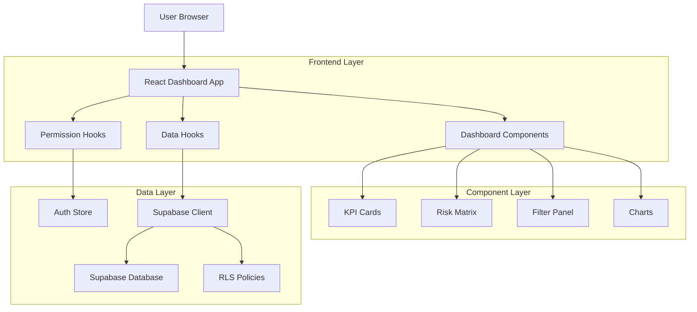
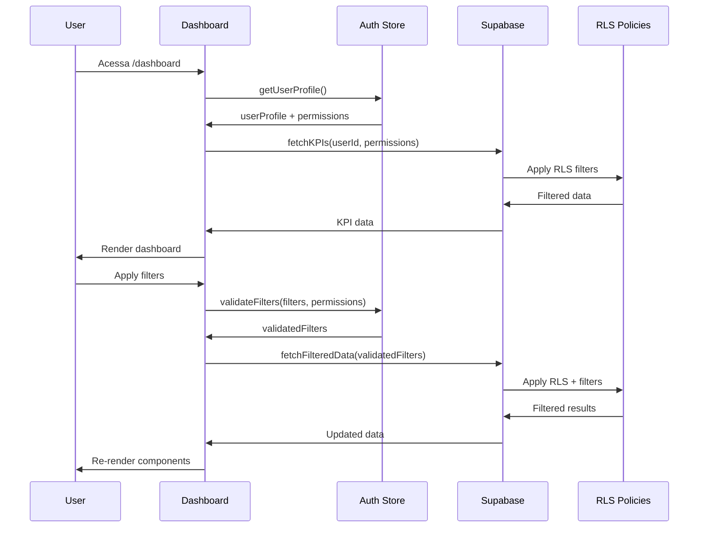

# Epic 4: Dashboard Executivo Dinâmico - Arquitetura Técnica

## 1. Arquitetura Geral

### 1.1 Diagrama de Arquitetura



### 1.2 Fluxo de Dados com Permissões



## 2. Especificações Técnicas

### 2.1 Stack Tecnológica

- **Frontend**: React 18 + TypeScript + Tailwind CSS + Vite
- **Estado**: Zustand (Auth Store) + React Query (Data fetching)
- **Gráficos**: Recharts + D3.js (para matriz de riscos)
- **Backend**: Supabase (PostgreSQL + RLS)
- **Autenticação**: Supabase Auth
- **Cache**: React Query + localStorage

### 2.2 Estrutura de Rotas

| Rota | Componente | Proteção | Descrição |
|------|------------|----------|----------|
| `/dashboard` | DashboardPage | ProtectedRoute | Página principal do dashboard |
| `/dashboard/risk/:id` | RiskDetailModal | ProtectedRoute | Modal de detalhes do risco |
| `/dashboard/export` | ExportModal | ProtectedRoute + canExport | Modal de exportação |

## 3. Estrutura de Componentes Detalhada

### 3.1 Hierarquia de Componentes

```
DashboardPage
├── DashboardHeader
│   ├── PageTitle
│   └── RefreshButton
├── KPISection
│   ├── KPIContainer
│   │   ├── KPICard (Total Riscos)
│   │   ├── KPICard (Riscos Críticos)
│   │   ├── KPICard (Riscos Vencidos)
│   │   └── KPICard (Taxa Mitigação)
│   └── KPILoadingSkeleton
├── FilterSection
│   ├── FilterPanel
│   │   ├── DateRangeFilter
│   │   ├── ResponsibleFilter
│   │   ├── RiskTypeFilter
│   │   └── StatusFilter
│   └── FilterSummary
├── MainContent
│   ├── RiskMatrixSection
│   │   ├── RiskMatrix
│   │   │   ├── MatrixGrid
│   │   │   ├── MatrixCell
│   │   │   └── RiskTooltip
│   │   └── MatrixLegend
│   └── ChartsSection
│       ├── TimelineChart
│       ├── AreaDistributionChart
│       └── TopRisksList
└── EmptyStateHandler
    ├── NoDataState
    ├── NoPermissionState
    └── LoadingState
```

### 3.2 Componentes Principais

#### 3.2.1 DashboardPage.tsx
```typescript
interface DashboardPageProps {
  className?: string;
}

const DashboardPage: React.FC<DashboardPageProps> = ({ className }) => {
  const { user, userProfile } = useAuth();
  const { filters, updateFilters } = useDashboardFilters();
  const { data: kpis, isLoading: kpisLoading } = useKPIs(user?.id, filters);
  const { data: matrixData, isLoading: matrixLoading } = useRiskMatrix(user?.id, filters);
  const permissions = useDashboardPermissions();

  if (!user || !userProfile) {
    return <NoPermissionState />;
  }

  return (
    <div className={cn("dashboard-page", className)}>
      <DashboardHeader />
      <KPISection kpis={kpis} loading={kpisLoading} />
      <FilterSection 
        filters={filters} 
        onFiltersChange={updateFilters}
        permissions={permissions}
      />
      <MainContent 
        matrixData={matrixData}
        matrixLoading={matrixLoading}
        filters={filters}
      />
    </div>
  );
};
```

#### 3.2.2 KPICard.tsx
```typescript
interface KPICardProps {
  kpi: KPI;
  loading?: boolean;
  onClick?: () => void;
}

const KPICard: React.FC<KPICardProps> = ({ kpi, loading, onClick }) => {
  const trendIcon = {
    up: <TrendingUp className="w-4 h-4 text-green-500" />,
    down: <TrendingDown className="w-4 h-4 text-red-500" />,
    stable: <Minus className="w-4 h-4 text-gray-500" />
  };

  const colorClasses = {
    green: 'border-green-200 bg-green-50',
    yellow: 'border-yellow-200 bg-yellow-50',
    orange: 'border-orange-200 bg-orange-50',
    red: 'border-red-200 bg-red-50'
  };

  if (loading) {
    return <KPICardSkeleton />;
  }

  return (
    <Card 
      className={cn(
        "p-6 cursor-pointer transition-all hover:shadow-md",
        colorClasses[kpi.color]
      )}
      onClick={onClick}
    >
      <div className="flex items-center justify-between">
        <div>
          <p className="text-sm font-medium text-gray-600">{kpi.title}</p>
          <p className="text-2xl font-bold text-gray-900">
            {formatKPIValue(kpi.value, kpi.format)}
          </p>
          {kpi.previousValue && (
            <div className="flex items-center mt-1">
              {trendIcon[kpi.trend]}
              <span className="text-xs text-gray-500 ml-1">
                {calculateTrendPercentage(kpi.value, kpi.previousValue)}%
              </span>
            </div>
          )}
        </div>
        <div className="text-right">
          <Badge variant={kpi.color}>
            {kpi.color.toUpperCase()}
          </Badge>
        </div>
      </div>
      {kpi.description && (
        <p className="text-xs text-gray-500 mt-2">{kpi.description}</p>
      )}
    </Card>
  );
};
```

#### 3.2.3 RiskMatrix.tsx
```typescript
interface RiskMatrixProps {
  data: RiskMatrixData[][];
  onCellClick: (probability: number, impact: number) => void;
  loading?: boolean;
}

const RiskMatrix: React.FC<RiskMatrixProps> = ({ data, onCellClick, loading }) => {
  const getSeverityColor = (probability: number, impact: number): string => {
    const score = probability * impact;
    if (score <= 4) return 'bg-green-200 hover:bg-green-300';
    if (score <= 9) return 'bg-yellow-200 hover:bg-yellow-300';
    if (score <= 16) return 'bg-orange-200 hover:bg-orange-300';
    return 'bg-red-200 hover:bg-red-300';
  };

  if (loading) {
    return <MatrixSkeleton />;
  }

  return (
    <div className="risk-matrix">
      <div className="matrix-header">
        <h3 className="text-lg font-semibold mb-4">Matriz de Riscos</h3>
        <div className="flex items-center space-x-4 mb-4">
          <span className="text-sm text-gray-600">Impacto →</span>
        </div>
      </div>
      
      <div className="matrix-grid grid grid-cols-6 gap-1">
        {/* Header row */}
        <div className="matrix-cell-header"></div>
        {[1, 2, 3, 4, 5].map(impact => (
          <div key={impact} className="matrix-cell-header text-center font-medium">
            {impact}
          </div>
        ))}
        
        {/* Matrix cells */}
        {[5, 4, 3, 2, 1].map(probability => (
          <React.Fragment key={probability}>
            <div className="matrix-cell-header flex items-center justify-center font-medium">
              {probability === 3 && (
                <span className="transform -rotate-90 text-sm text-gray-600">
                  Probabilidade
                </span>
              )}
              <span className="ml-2">{probability}</span>
            </div>
            {[1, 2, 3, 4, 5].map(impact => {
              const cellData = data[probability - 1]?.[impact - 1];
              return (
                <MatrixCell
                  key={`${probability}-${impact}`}
                  probability={probability}
                  impact={impact}
                  data={cellData}
                  className={getSeverityColor(probability, impact)}
                  onClick={() => onCellClick(probability, impact)}
                />
              );
            })}
          </React.Fragment>
        ))}
      </div>
      
      <MatrixLegend />
    </div>
  );
};
```

## 4. Hooks Personalizados

### 4.1 useDashboardData.ts
```typescript
interface UseDashboardDataProps {
  userId: string;
  filters: DashboardFilters;
}

export const useDashboardData = ({ userId, filters }: UseDashboardDataProps) => {
  const { data: kpis, isLoading: kpisLoading, error: kpisError } = useQuery(
    ['dashboard-kpis', userId, filters],
    () => fetchDashboardKPIs(userId, filters),
    {
      staleTime: 5 * 60 * 1000, // 5 minutes
      cacheTime: 10 * 60 * 1000, // 10 minutes
      refetchOnWindowFocus: false,
    }
  );

  const { data: matrixData, isLoading: matrixLoading, error: matrixError } = useQuery(
    ['risk-matrix', userId, filters],
    () => fetchRiskMatrix(userId, filters),
    {
      staleTime: 2 * 60 * 1000, // 2 minutes
      enabled: !!userId,
    }
  );

  const { data: chartData, isLoading: chartLoading } = useQuery(
    ['dashboard-charts', userId, filters],
    () => fetchDashboardCharts(userId, filters),
    {
      staleTime: 5 * 60 * 1000,
      enabled: !!userId,
    }
  );

  return {
    kpis,
    matrixData,
    chartData,
    isLoading: kpisLoading || matrixLoading || chartLoading,
    error: kpisError || matrixError,
    refetch: () => {
      // Refetch all queries
    }
  };
};
```

### 4.2 useDashboardFilters.ts
```typescript
interface UseDashboardFiltersReturn {
  filters: DashboardFilters;
  updateFilters: (newFilters: Partial<DashboardFilters>) => void;
  resetFilters: () => void;
  availableFilters: AvailableFilters;
}

export const useDashboardFilters = (): UseDashboardFiltersReturn => {
  const { user } = useAuth();
  const [filters, setFilters] = useState<DashboardFilters>(getDefaultFilters());
  
  const { data: availableFilters } = useQuery(
    ['available-filters', user?.id],
    () => fetchAvailableFilters(user?.id),
    {
      enabled: !!user?.id,
      staleTime: 10 * 60 * 1000, // 10 minutes
    }
  );

  const updateFilters = useCallback((newFilters: Partial<DashboardFilters>) => {
    setFilters(prev => ({ ...prev, ...newFilters }));
    
    // Persist to localStorage
    localStorage.setItem('dashboard-filters', JSON.stringify({ ...filters, ...newFilters }));
  }, [filters]);

  const resetFilters = useCallback(() => {
    const defaultFilters = getDefaultFilters();
    setFilters(defaultFilters);
    localStorage.removeItem('dashboard-filters');
  }, []);

  // Load filters from localStorage on mount
  useEffect(() => {
    const savedFilters = localStorage.getItem('dashboard-filters');
    if (savedFilters) {
      try {
        const parsed = JSON.parse(savedFilters);
        setFilters(prev => ({ ...prev, ...parsed }));
      } catch (error) {
        console.warn('Failed to parse saved filters:', error);
      }
    }
  }, []);

  return {
    filters,
    updateFilters,
    resetFilters,
    availableFilters: availableFilters || getDefaultAvailableFilters()
  };
};
```

### 4.3 useDashboardPermissions.ts
```typescript
interface DashboardPermissions {
  canViewAllRisks: boolean;
  canViewAllAreas: boolean;
  canExportData: boolean;
  allowedAreas: string[];
  allowedUsers: string[];
  allowedRiskTypes: RiskType[];
}

export const useDashboardPermissions = (): DashboardPermissions => {
  const { user, userProfile } = useAuth();
  
  return useMemo(() => {
    if (!userProfile) {
      return {
        canViewAllRisks: false,
        canViewAllAreas: false,
        canExportData: false,
        allowedAreas: [],
        allowedUsers: [],
        allowedRiskTypes: []
      };
    }

    const permissions = userProfile.perfil.permissoes;
    
    return {
      canViewAllRisks: permissions.includes('VIEW_ALL_RISKS'),
      canViewAllAreas: permissions.includes('VIEW_ALL_AREAS'),
      canExportData: permissions.includes('EXPORT_DATA'),
      allowedAreas: userProfile.areas_acesso || [],
      allowedUsers: userProfile.usuarios_acesso || [],
      allowedRiskTypes: userProfile.tipos_risco_acesso || []
    };
  }, [userProfile]);
};
```

## 5. Estrutura de Dados e APIs

### 5.1 Tabelas do Banco de Dados

#### 5.1.1 Extensão da Tabela de Riscos
```sql
-- Adicionar campos para dashboard
ALTER TABLE riscos ADD COLUMN IF NOT EXISTS dashboard_visible BOOLEAN DEFAULT true;
ALTER TABLE riscos ADD COLUMN IF NOT EXISTS dashboard_priority INTEGER DEFAULT 0;
ALTER TABLE riscos ADD COLUMN IF NOT EXISTS last_updated_dashboard TIMESTAMP WITH TIME ZONE DEFAULT NOW();

-- Índices para performance
CREATE INDEX IF NOT EXISTS idx_riscos_dashboard_visible ON riscos(dashboard_visible);
CREATE INDEX IF NOT EXISTS idx_riscos_dashboard_priority ON riscos(dashboard_priority DESC);
CREATE INDEX IF NOT EXISTS idx_riscos_area_responsavel ON riscos(area_responsavel);
CREATE INDEX IF NOT EXISTS idx_riscos_data_identificacao ON riscos(data_identificacao DESC);
```

#### 5.1.2 Tabela de KPIs Configuráveis
```sql
CREATE TABLE dashboard_kpis (
    id UUID PRIMARY KEY DEFAULT gen_random_uuid(),
    nome VARCHAR(100) NOT NULL,
    descricao TEXT,
    query_sql TEXT NOT NULL,
    formato VARCHAR(20) DEFAULT 'number' CHECK (formato IN ('number', 'percentage', 'currency')),
    cor VARCHAR(20) DEFAULT 'blue' CHECK (cor IN ('green', 'yellow', 'orange', 'red', 'blue')),
    ordem INTEGER DEFAULT 0,
    ativo BOOLEAN DEFAULT true,
    perfis_acesso TEXT[] DEFAULT '{}',
    created_at TIMESTAMP WITH TIME ZONE DEFAULT NOW(),
    updated_at TIMESTAMP WITH TIME ZONE DEFAULT NOW()
);

-- RLS para KPIs
ALTER TABLE dashboard_kpis ENABLE ROW LEVEL SECURITY;

CREATE POLICY "Users can view KPIs for their profile" ON dashboard_kpis
    FOR SELECT USING (
        auth.uid() IN (
            SELECT u.id FROM usuarios u 
            JOIN perfis p ON u.perfil_id = p.id 
            WHERE p.nome = ANY(perfis_acesso)
        )
    );
```

#### 5.1.3 Tabela de Cache de Dashboard
```sql
CREATE TABLE dashboard_cache (
    id UUID PRIMARY KEY DEFAULT gen_random_uuid(),
    user_id UUID REFERENCES auth.users(id),
    cache_key VARCHAR(255) NOT NULL,
    data JSONB NOT NULL,
    expires_at TIMESTAMP WITH TIME ZONE NOT NULL,
    created_at TIMESTAMP WITH TIME ZONE DEFAULT NOW()
);

-- Índices para cache
CREATE INDEX idx_dashboard_cache_user_key ON dashboard_cache(user_id, cache_key);
CREATE INDEX idx_dashboard_cache_expires ON dashboard_cache(expires_at);

-- Função para limpeza automática do cache
CREATE OR REPLACE FUNCTION cleanup_dashboard_cache()
RETURNS void AS $$
BEGIN
    DELETE FROM dashboard_cache WHERE expires_at < NOW();
END;
$$ LANGUAGE plpgsql;
```

### 5.2 Funções SQL para KPIs

#### 5.2.1 Função para Total de Riscos Ativos
```sql
CREATE OR REPLACE FUNCTION get_total_riscos_ativos(p_user_id UUID, p_filters JSONB DEFAULT '{}')
RETURNS INTEGER AS $$
DECLARE
    total INTEGER;
    user_areas TEXT[];
BEGIN
    -- Obter áreas do usuário
    SELECT areas_acesso INTO user_areas
    FROM usuarios 
    WHERE id = p_user_id;
    
    -- Contar riscos ativos com filtros
    SELECT COUNT(*)
    INTO total
    FROM riscos r
    WHERE r.status = 'ativo'
      AND r.dashboard_visible = true
      AND (user_areas IS NULL OR r.area_responsavel = ANY(user_areas))
      AND (
          p_filters->>'dateStart' IS NULL OR 
          r.data_identificacao >= (p_filters->>'dateStart')::DATE
      )
      AND (
          p_filters->>'dateEnd' IS NULL OR 
          r.data_identificacao <= (p_filters->>'dateEnd')::DATE
      );
    
    RETURN COALESCE(total, 0);
END;
$$ LANGUAGE plpgsql SECURITY DEFINER;
```

#### 5.2.2 Função para Matriz de Riscos
```sql
CREATE OR REPLACE FUNCTION get_risk_matrix_data(p_user_id UUID, p_filters JSONB DEFAULT '{}')
RETURNS TABLE(
    probabilidade INTEGER,
    impacto INTEGER,
    count_riscos INTEGER,
    riscos JSONB
) AS $$
DECLARE
    user_areas TEXT[];
BEGIN
    -- Obter áreas do usuário
    SELECT areas_acesso INTO user_areas
    FROM usuarios 
    WHERE id = p_user_id;
    
    RETURN QUERY
    SELECT 
        r.probabilidade,
        r.impacto,
        COUNT(*)::INTEGER as count_riscos,
        jsonb_agg(
            jsonb_build_object(
                'id', r.id,
                'titulo', r.titulo,
                'area', r.area_responsavel,
                'responsavel', r.responsavel,
                'severidade', 
                CASE 
                    WHEN r.probabilidade * r.impacto <= 4 THEN 'low'
                    WHEN r.probabilidade * r.impacto <= 9 THEN 'medium'
                    WHEN r.probabilidade * r.impacto <= 16 THEN 'high'
                    ELSE 'critical'
                END
            )
        ) as riscos
    FROM riscos r
    WHERE r.status = 'ativo'
      AND r.dashboard_visible = true
      AND (user_areas IS NULL OR r.area_responsavel = ANY(user_areas))
      AND (
          p_filters->>'dateStart' IS NULL OR 
          r.data_identificacao >= (p_filters->>'dateStart')::DATE
      )
      AND (
          p_filters->>'dateEnd' IS NULL OR 
          r.data_identificacao <= (p_filters->>'dateEnd')::DATE
      )
    GROUP BY r.probabilidade, r.impacto
    ORDER BY r.probabilidade DESC, r.impacto ASC;
END;
$$ LANGUAGE plpgsql SECURITY DEFINER;
```

### 5.3 APIs do Dashboard

#### 5.3.1 Service Layer
```typescript
// services/dashboardService.ts
export class DashboardService {
  private supabase: SupabaseClient;
  
  constructor(supabase: SupabaseClient) {
    this.supabase = supabase;
  }

  async getKPIs(userId: string, filters: DashboardFilters): Promise<KPI[]> {
    const { data, error } = await this.supabase.rpc('get_dashboard_kpis', {
      p_user_id: userId,
      p_filters: filters
    });

    if (error) throw error;
    return data;
  }

  async getRiskMatrix(userId: string, filters: DashboardFilters): Promise<RiskMatrixData[][]> {
    const { data, error } = await this.supabase.rpc('get_risk_matrix_data', {
      p_user_id: userId,
      p_filters: filters
    });

    if (error) throw error;
    
    // Transform flat data into 5x5 matrix
    return this.transformToMatrix(data);
  }

  async getAvailableFilters(userId: string): Promise<AvailableFilters> {
    const [users, areas, riskTypes] = await Promise.all([
      this.getAvailableUsers(userId),
      this.getAvailableAreas(userId),
      this.getAvailableRiskTypes(userId)
    ]);

    return { users, areas, riskTypes };
  }

  private transformToMatrix(data: any[]): RiskMatrixData[][] {
    const matrix: RiskMatrixData[][] = Array(5).fill(null).map(() => 
      Array(5).fill(null).map(() => ({ probability: 0, impact: 0, count: 0, risks: [] }))
    );

    data.forEach(item => {
      const probIndex = item.probabilidade - 1;
      const impactIndex = item.impacto - 1;
      
      if (probIndex >= 0 && probIndex < 5 && impactIndex >= 0 && impactIndex < 5) {
        matrix[probIndex][impactIndex] = {
          probability: item.probabilidade,
          impact: item.impacto,
          count: item.count_riscos,
          risks: item.riscos
        };
      }
    });

    return matrix;
  }
}
```

## 6. Testes

### 6.1 Testes de Componentes
```typescript
// __tests__/components/KPICard.test.tsx
describe('KPICard', () => {
  const mockKPI: KPI = {
    id: '1',
    title: 'Total Riscos',
    value: 42,
    previousValue: 38,
    trend: 'up',
    format: 'number',
    color: 'green'
  };

  it('renders KPI data correctly', () => {
    render(<KPICard kpi={mockKPI} />);
    
    expect(screen.getByText('Total Riscos')).toBeInTheDocument();
    expect(screen.getByText('42')).toBeInTheDocument();
    expect(screen.getByText(/10.5%/)).toBeInTheDocument(); // trend calculation
  });

  it('shows loading state', () => {
    render(<KPICard kpi={mockKPI} loading={true} />);
    
    expect(screen.getByTestId('kpi-skeleton')).toBeInTheDocument();
  });

  it('handles click events', () => {
    const onClickMock = jest.fn();
    render(<KPICard kpi={mockKPI} onClick={onClickMock} />);
    
    fireEvent.click(screen.getByRole('button'));
    expect(onClickMock).toHaveBeenCalledTimes(1);
  });
});
```

### 6.2 Testes de Hooks
```typescript
// __tests__/hooks/useDashboardData.test.tsx
describe('useDashboardData', () => {
  const mockUserId = 'user-123';
  const mockFilters: DashboardFilters = {
    dateRange: { start: new Date('2024-01-01'), end: new Date('2024-12-31') },
    responsibleIds: [],
    riskTypes: [],
    statuses: [],
    areas: []
  };

  beforeEach(() => {
    jest.clearAllMocks();
  });

  it('fetches dashboard data successfully', async () => {
    const mockKPIs = [{ id: '1', title: 'Test KPI', value: 10 }];
    
    (fetchDashboardKPIs as jest.Mock).mockResolvedValue(mockKPIs);
    
    const { result, waitFor } = renderHook(() => 
      useDashboardData({ userId: mockUserId, filters: mockFilters })
    );

    await waitFor(() => {
      expect(result.current.isLoading).toBe(false);
    });

    expect(result.current.kpis).toEqual(mockKPIs);
    expect(result.current.error).toBeNull();
  });

  it('handles errors gracefully', async () => {
    const mockError = new Error('Failed to fetch');
    (fetchDashboardKPIs as jest.Mock).mockRejectedValue(mockError);
    
    const { result, waitFor } = renderHook(() => 
      useDashboardData({ userId: mockUserId, filters: mockFilters })
    );

    await waitFor(() => {
      expect(result.current.isLoading).toBe(false);
    });

    expect(result.current.error).toEqual(mockError);
  });
});
```

### 6.3 Testes E2E
```typescript
// e2e/dashboard.spec.ts
describe('Dashboard E2E', () => {
  beforeEach(async () => {
    await page.goto('/login');
    await loginAsUser('admin@cogerh.com.br', 'password');
    await page.goto('/dashboard');
  });

  it('loads dashboard with correct permissions', async () => {
    // Verify KPIs are visible
    await expect(page.locator('[data-testid="kpi-total-riscos"]')).toBeVisible();
    await expect(page.locator('[data-testid="kpi-riscos-criticos"]')).toBeVisible();
    
    // Verify risk matrix is rendered
    await expect(page.locator('[data-testid="risk-matrix"]')).toBeVisible();
    
    // Verify filters are available
    await expect(page.locator('[data-testid="filter-panel"]')).toBeVisible();
  });

  it('applies filters correctly', async () => {
    // Apply date filter
    await page.click('[data-testid="date-filter"]');
    await page.fill('[data-testid="date-start"]', '2024-01-01');
    await page.fill('[data-testid="date-end"]', '2024-06-30');
    await page.click('[data-testid="apply-filters"]');
    
    // Wait for data to update
    await page.waitForLoadState('networkidle');
    
    // Verify filtered data is displayed
    const kpiValue = await page.textContent('[data-testid="kpi-total-riscos"] .kpi-value');
    expect(parseInt(kpiValue || '0')).toBeGreaterThan(0);
  });

  it('respects user permissions', async () => {
    // Login as restricted user
    await page.goto('/login');
    await loginAsUser('user@cogerh.com.br', 'password');
    await page.goto('/dashboard');
    
    // Verify limited data access
    const exportButton = page.locator('[data-testid="export-button"]');
    await expect(exportButton).not.toBeVisible();
    
    // Verify area-specific data
    const areaFilter = page.locator('[data-testid="area-filter"]');
    const options = await areaFilter.locator('option').count();
    expect(options).toBeLessThan(5); // Restricted areas
  });
});
```

## 7. Considerações de Deployment

### 7.1 Variáveis de Ambiente
```env
# Dashboard específico
VITE_DASHBOARD_CACHE_TTL=300000
VITE_DASHBOARD_REFRESH_INTERVAL=60000
VITE_DASHBOARD_MAX_MATRIX_SIZE=25
VITE_ENABLE_DASHBOARD_EXPORT=true

# Performance
VITE_DASHBOARD_LAZY_LOADING=true
VITE_DASHBOARD_VIRTUAL_SCROLLING=true
```

### 7.2 Build Otimizado
```typescript
// vite.config.ts - configurações específicas para dashboard
export default defineConfig({
  build: {
    rollupOptions: {
      output: {
        manualChunks: {
          'dashboard-core': ['./src/pages/Dashboard/DashboardPage.tsx'],
          'dashboard-components': [
            './src/pages/Dashboard/components/KPICard.tsx',
            './src/pages/Dashboard/components/RiskMatrix.tsx'
          ],
          'charts': ['recharts', 'd3']
        }
      }
    }
  }
});
```

## 8. Monitoramento e Métricas

### 8.1 Métricas de Performance
- Tempo de carregamento inicial do dashboard
- Tempo de resposta dos filtros
- Taxa de erro nas consultas
- Uso de cache (hit rate)

### 8.2 Logs de Auditoria
```typescript
// Logging de acesso ao dashboard
const logDashboardAccess = async (userId: string, action: string, data?: any) => {
  await supabase.from('audit_logs').insert({
    user_id: userId,
    action: `dashboard_${action}`,
    resource: 'dashboard',
    data: data,
    timestamp: new Date().toISOString()
  });
};
```

Esta arquitetura técnica fornece uma base sólida para implementação do Dashboard Executivo Dinâmico, garantindo performance, segurança e escalabilidade.